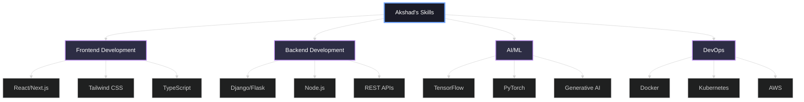
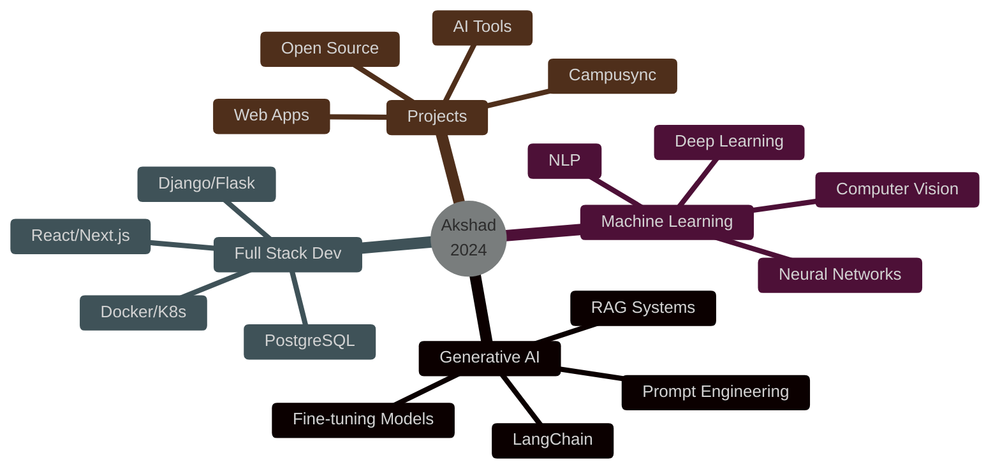

<div align="center">

<!-- Animated Header -->


<!-- Typing SVG -->
<a href="https://git.io/typing-svg"></a>

<!-- Profile Views Counter with animation -->


</div>

---

<!-- Animated Snake -->
<div align="center">
  <picture>
    <source media="(prefers-color-scheme: dark)" srcset="https://raw.githubusercontent.com/akshadtech17/akshadtech17/output/github-contribution-grid-snake-dark.svg">
    <source media="(prefers-color-scheme: light)" srcset="https://raw.githubusercontent.com/akshadtech17/akshadtech17/output/github-contribution-grid-snake.svg">
    
  </picture>
</div>

---

## 🚀 About Me


```yaml
name: Akshad Deepak Aloni
located_in: Nagpur, Maharashtra, India
current_focus: Generative AI & Machine Learning
education: ["Computer Science", "AI Enthusiast"]
hobbies: ["Coding", "Breaking & Fixing Things", "Learning"]

currently_working_on: "Campusync"
learning: ["Generative AI", "RAG", "Machine Learning", "Deep Learning"]

philosophy: |
  "The best way to predict the future is to create it.
   Break things, fix them better, repeat."
```

### 🎯 Current Mission
- 🔭 Building **[Campusync](https://github.com/Akshadtech17/Campusync)** - Revolutionizing campus management
- 🌱 Deep diving into **Generative AI, RAG, ML & DL**
- 💡 Creating solutions that matter
- ⚡ Fun fact: **I break things just to fix them better!**

---

## 🛠️ Tech Arsenal

<div align="center">

### 💻 Programming Languages


### 🎨 Frontend Development


### ⚙️ Backend Development


### 🗄️ Databases


### ☁️ DevOps & Cloud


### 🤖 AI/ML & Data Science

<br/>


### 🔧 Tools & Others


</div>

---

## 📊 GitHub Analytics

<div align="center">
  
  
</div>

<div align="center">
  
  
</div>

---

## 🏆 GitHub Trophies

<div align="center">
  
</div>

---

## 💼 Coding Profiles & Achievements

<div align="center">

### 🎯 Competitive Programming
[](https://leetcode.com/akaloni17)
[](https://codeforces.com/profile/akaloni17)
[](https://www.codechef.com/users/akaloni17)
[](https://www.hackerrank.com/akaloni17)
[](https://auth.geeksforgeeks.org/user/akalomsnn)

### 📊 Data Science
[](https://kaggle.com/akshadaloni)

### 💡 Problem Solving Stats


</div>

---

## 📈 Contribution Graph

<div align="center">
  
</div>

---

## 🎯 Skills Radar

<div align="center">



</div>

---

## 🌐 Connect With Me

<div align="center">

[](https://linkedin.com/in/akshad-aloni-78a887212)
[](https://twitter.com/akshadalon63299)
[](https://instagram.com/akshad_1365)
[](https://stackoverflow.com/users/26246484)
[](mailto:akaloni17@gmail.com)

### 📬 Let's Collaborate!


**Email:** akaloni17@gmail.com

</div>

---

## 📊 Weekly Development Breakdown

<!--START_SECTION:waka-->
```text
Python       12 hrs 30 mins  ████████████░░░░░░░░░   48.2%
JavaScript    6 hrs 15 mins  ██████░░░░░░░░░░░░░░░   24.1%
TypeScript    4 hrs 20 mins  ████░░░░░░░░░░░░░░░░░   16.7%
HTML/CSS      2 hrs 5 mins   ██░░░░░░░░░░░░░░░░░░░    8.0%
Other         0 hrs 47 mins  █░░░░░░░░░░░░░░░░░░░░    3.0%
```
<!--END_SECTION:waka-->

---

## 🎨 Current Focus Areas

<div align="center">



</div>

---

## 💡 Random Dev Quote

<div align="center">


</div>

---

## 🎵 Spotify Playing

<div align="center">

[](https://spotify-github-profile.vercel.app/api/view?uid=31l5bvqaosa2efoxt6p2phdv4ekq&redirect=true)

</div>

---

## 📅 Contribution Timeline

<div align="center">


</div>

---

## 🌟 Featured Projects

<div align="center">

[](https://github.com/Akshadtech17/Campusync)

</div>

---

## 🐍 Watch My Contributions Get Eaten!

<div align="center">


</div>

---

<div align="center">

### 💭 Developer's Philosophy

```python
class Developer:
    def __init__(self):
        self.name = "Akshad Aloni"
        self.role = "Full Stack Developer & AI Enthusiast"
        self.language_spoken = ["Python", "JavaScript", "C++"]
        
    def say_hi(self):
        print("Thanks for visiting my profile! Let's build something amazing together!")
        
    def keep_learning(self):
        while True:
            self.improve()
            self.break_things()
            self.fix_better()
            
me = Developer()
me.say_hi()
me.keep_learning()
```

### 🎯 2024 Goals
- [ ] Master Generative AI & RAG Systems
- [ ] Contribute to 10+ Open Source Projects
- [ ] Build 5 Production-Ready AI Applications
- [ ] Reach 1000+ GitHub Followers
- [ ] Learn Kubernetes & Advanced DevOps
- [ ] Publish Technical Blogs & Tutorials

---

### 💖 Support My Work

<a href="https://www.buymeacoffee.com/akshadtech17"></a>

---


### ⭐️ From [Akshad Aloni](https://github.com/akshadtech17) with 💙


</div>
